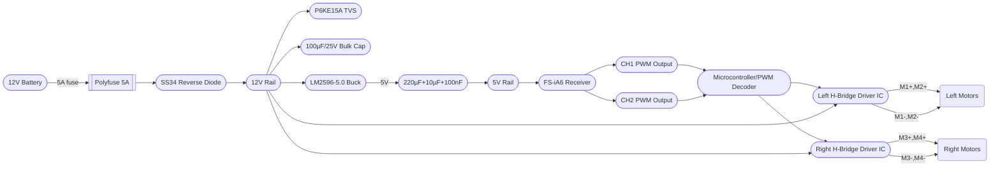

# Integrated 4WD Motor Controller PCB Design

This report presents a complete design for a fully-integrated 4WD RC rover motor controller PCB (100×80 mm, 2-layer FR4 1.6 mm, 2 oz copper) replacing the external IBT-2 (BTS7960) modules. The board takes 12 V battery input (with 5 A polyfuse and SS34 reverse diode), steps it down to 5 V/2 A via an LM2596-5.0 buck, and powers a FlySky FS-iA6 receiver. Two RC PWM inputs (CH1, CH2) from the receiver are decoded (via an on-board microcontroller/PWM decoder) to drive two high-current H-bridge drivers (one per side) that each drive two DC motors in parallel. Comprehensive protection includes 100 µF/25 V bulk caps on the 12 V rail, a P6KE15A TVS, input polyfuse and reverse diode, and motor snubber capacitors. High-current traces and copper pours are used throughout. The design includes detailed BOM, PCB stackup, trace width calculations, placement plan, thermal/copper pour recommendations, file structure guidance, and test procedures. 

## System Block Diagram & Signals

The block diagram below summarizes the key functions and signal flow. The 12 V battery (with a 5 A polyfuse and SS34 reverse diode) feeds the 12 V power rail (with 100 µF bulk cap and P6KE15A TVS for spike protection). A buck converter (LM2596-5.0, 100 µH, 1N5822, 220 µF, decoupling caps) generates 5 V/2 A (to power the FS-iA6 receiver and logic). The FS-iA6 receiver is powered by 5 V and its CH1/CH2 PWM outputs (via 3-pin servo headers) feed a microcontroller (MCU) or PWM decoder. The MCU outputs drive two H-bridge stages (Left and Right) via gate drivers. Each H-bridge is supplied by the 12 V rail and drives two parallel motors on that side (through M1–M4 terminals). High-side and low-side MOSFETs with body diodes handle inductive motor currents and flyback, aided by motor suppression caps (C1, C2) to reduce EMI.

Figure: *Block diagram of the 4WD controller. Left/Right PWM (CH2/CH1) from the FS-iA6 receiver feed a decoder/MCU that generates high‑side (R_PWM) and low‑side (L_PWM) drive signals for each dual-H‑bridge. Left H‑bridge drives M1/M2 in parallel, right drives M3/M4. All power flows from the 12 V rail (fused, reversed-protected, with TVS and bulk cap) into the buck (to 5 V) and into the two motor driver ICs/MOSFET bridges. The 5 V rail powers the receiver and MCU; ground is common. (Diagram: mermaid flowchart)*

## Component Selection & Schematic

- **Battery Input:** 2‑pin 5.08 mm screw terminal (e.g. Same Sky TB0014-508-02GR, 2.54 mm pitch, 2‑pos, rated 12 A/300 V) for BAT+ and BAT–. Place a 5 A polyfuse (resettable PPTC, e.g. Littelfuse 30R500) in series on BAT+. A SS34 Schottky diode (3 A, 40 V) protects against reverse polarity on BAT+. 

- **Buck Converter (5V/2A):** TI LM2596S-5.0 (fixed 5.0 V output, in TO-263-5 package). The LM2596 is a 150 kHz step-down regulator capable of 3 A load. Use a 100 µH power inductor (≥3 A), a 1N5822 Schottky diode for the LM2596 output, and a 220 µF/10 V electrolytic plus 10 µF and 0.1 µF decoupling caps on the 5 V output. (Datasheet recommends these external parts for stability and low ripple.) The buck’s ground and switch node should use short, wide traces. 

- **Receiver (FS-iA6):** Powered from the 5 V rail (5 V to its Vcc, GND to ground). It provides PWM signals on CH1 and CH2 lines (servo-style 1–2 ms pulses). These connect to 3‑pin headers (“CH1”, “CH2”) on the PCB: pin order GND, 5V, SIG (servo convention). We omit an external PWM decoder module by using a microcontroller to interpret these signals.

- **MCU / PWM Decoder:** A small microcontroller (e.g. ATmega328P or PIC) can decode the two servo PWM inputs into two sets of H-bridge drive signals (R_PWM, L_PWM, R_EN, L_EN for each side). Alternatively, two identical discrete PWM-decoder ICs could be used. The MCU’s 5 V and ground pins tie to the board. (Footprint: a 28‑pin DIP/SMD or SOIC MCU; if DIP, consider space, else an SMD 32-pin QFP). Include decoupling caps (0.1 µF) by the MCU. Pull-up resistors (10 kΩ) tie each R_EN and L_EN line to 5 V to keep the H-bridges enabled by default.

- **H‑Bridge Drivers:** For each side (Left, Right) we need a dual high-current bridge. Options:
  - **Integrated IC:** Use a dual H‑bridge driver IC rated ~40–50 A per channel (if available). However, most require external MOSFETs for very high current.
  - **Discrete MOSFETs:** Use four N-channel MOSFETs per H-bridge (two high-side + two low-side) plus boot-strap drivers. For example, Infineon IRFP3206N (60 V, 3 mΩ, 200 A) or similar FETs (TO‑220 DPAK) will comfortably handle tens of amps. IRFP3206N’s low R_DS(on) limits dissipation. Each MOSFET requires a gate driver. The IR2104STRPBF (half-bridge driver, 1 input + inverted input, 600 V rating) is a suitable driver (one per H-bridge). It provides bootstrap high-side drive and logic low-side drive (VIN up to 600 V, logic down to 3.3 V). Two IR2104s (one for LEFT, one for RIGHT) each drive the pair of MOSFETs. Place a 0.1–1 Ω current-sense resistor in series with each motor pair to optionally measure current (can use INA modules). Include 10 Ω gate resistors and 100 kΩ gate pulldowns for each MOSFET for stability.

- **Decoupling & Protection:** Bulk capacitors (C1, C2) on the 12 V rail near the MOSFETs (≥100 µF, 25 V electrolytic) plus 0.1 µF ceramic for high-frequency spikes. TVS diode P6KE15A across 12 V/GND clamps transients. Motor outputs should have 100 nF–220 nF capacitors to chassis for EMI, or rely on MOSFET body diodes. The LM2596 input also has an electrolytic (220 µF/30 V) and an 0.1 µF decoupling cap as per TI reference.

- **Connectors:** Four 2‑pin 5.08 mm screw terminals (M1+,M1− through M4+,M4−) for motor outputs. (Wire M1/M2 in parallel to Left bridge, M3/M4 to Right.) 3-pin servo headers for CH1/CH2 signals. A 2‑pin 5.08 mm screw for BAT+,BAT−. Test points: small pads for 12 V, 5 V, GND, CH1, CH2. Four M3 mounting holes in corners (3.2 mm drill in 1.6 mm FR4) for chassis screws.

### Annotated BOM (selected items)

| Ref  | Qty | Part                               | Footprint        | Supplier Link                                        | Est. Price (ea) |
|------|-----|------------------------------------|------------------|-----------------------------------------------------|----------------|
| J1   | 1   | 2-pin screw terminal 5.08 mm (BAT) | TB0014-508       | Mouser: Same Sky TB0014-508-02GR       | $0.66          |
| J2–J5| 4   | 2-pin screw terminal 5.08 mm (M1–M4)| TB0014-508      | Mouser: Same Sky TB0014-508-02GR       | $0.66          |
| P1–P2| 2   | 3-pin servo header (2.54 mm)       | 3×1 0.1″ male    | – (e.g. Molex KK254 or equivalent)                  | $0.10          |
| U1   | 1   | LM2596S-5.0 (Buck 5 V, 3 A)        | TO-263-5         | TI LM2596S-5.0ADJ; DigiKey or Mouser (Analog Devices) | $1.00          |
| L1   | 1   | Inductor 100 µH 3 A                | Choke 8×8 mm     | TDK or Murata power inductor (100 µH, ~3–5 A)        | $0.50          |
| D2   | 1   | 1N5822 Schottky 40 V 3 A           | DO-201AD         | Vishay 1N5822-E3/54                       | $0.20          |
| D1   | 1   | SS34 Schottky 40 V 3 A             | SOD-123         | Taiwan Semi SS34LWH                 | $0.15          |
| F1   | 1   | Polyfuse 5 A PPTC                  | SMD (1206)       | Littelfuse 30R500UF (5 A hold)                       | $1.50          |
| D3   | 1   | P6KE15A TVS (15 V, 200 W)          | DO-214AC        | Vishay P6KE15A                        | $0.30          |
| U2,U3| 2   | IR2104STRPBF half-bridge driver    | SOIC-8          | Infineon IR2104STRPBF                 | $1.13          |
| Q1–Q4| 4   | N-MOSFET 60 V, <10 mΩ (logic-level)| D2PAK or TO-220| Infineon IRFP3206N (60 V, 3 mΩ, 200 A)               | $4.00          |
| R1–R4| 4   | Resistor, 10 Ω, 1 W                | 0805 (or 1206)   | Any high-power resistor                              | $0.20          |
| R5–R8| 4   | Resistor, 10 kΩ (pull-down)        | 0805            | Any                                              | $0.05          |
| C1,C2| 2   | 100 µF 25 V electrolytic           | Radial can      | (for 12 V rail)                                     | $0.50          |
| C3   | 1   | 220 µF 10 V electrolytic           | Radial can      | (buck output)                                       | $0.25          |
| C4,C5| 2   | 10 µF + 0.1 µF electrolytic/ceramic| 0805/1206       | (buck decoupling)                                   | $0.10          |
| C6–C9| 4   | 100 nF ceramic                    | 0805            | (decoupling: 5 V, 12 V rails, MCU)                  | $0.02          |
| C10,C11|2  | 100 nF ceramic (motor EMI)        | 0805            | (across motor terminals to ground)                  | $0.04          |
| LED1 | 1   | Power LED + 1 kΩ resistor         | 0805 + LED      | (indicate 5 V on)                                   | $0.10          |
| TP1–TP6|6 | Test points (TP1:5V, TP2:GND, TP3:CH1, TP4:CH2, TP5:12V, TP6:GND) | Testpoint | Keystone (e.g. 5000 series) | $0.10 ea |

*Table: Sample BOM entries (ref = designators) with footprints and approximate prices. Supplier links provided for key items (e.g. terminals, LM2596, IR2104, etc.). All footprints are standard (TB0014-508 terminal block, 0805 for passives, SOIC/SMD for ICs).*

## PCB Stack-up and Trace Widths

The board is 2-layer FR4, 1.6 mm thick, 2 oz copper (∼70 µm) on both sides. The top layer carries most power and signals, with a solid ground pour on the bottom layer. Heavy current traces (12 V, motor lines) are on top for maximum copper. Inner copper pours (if any) are tied through thermal vias under MOSFET pads.

**Layer usage:** 
- *Top layer:* Battery & motor power traces (wide), MOSFETs, gate drivers, buck converter, connectors, silkscreen. 
- *Bottom layer:* Ground plane (solid pour) with many thermal vias under MOSFETs/drivers. Bottom also carries any remaining signal traces (e.g. CH1/CH2, MCU signals) if needed. 
A thick ground pour on bottom connects to all ground pads and via stacks, providing a heat sink and low-impedance return. Per TI guidelines, making ground pours continuous and heavy copper significantly reduces device temperature (doubling copper halves thermal resistance). Multiple vias under each MOSFET/driver pad tie top and bottom planes together (via tenting optional).

**Trace widths:** Motor power and 12 V traces are sized for high current. Using IPC-2152 and empirical data, approximate widths for 2 oz copper: about *3–4 mm* for 10 A, *6–8 mm* for 20 A, and *≈10–12 mm* for 30 A (for ~50 °C rise in still air). For example, a 6 mm trace (~240 mils) on 2 oz copper can carry ~20 A. (By contrast, a 50 mil (~1.27 mm) 2 oz trace handles only ~4.8 A at 10 °C rise.) The final design should choose at least these widths or add parallel traces. Tables:

| Current per side | Recommended Trace Width (Top, 2 oz) |
|------------------|------------------------------------|
| 10 A             | ~3–4 mm (0.12–0.16″)               |
| 20 A             | ~6–8 mm                             |
| 30 A             | ~10–12 mm                           |

*Table: Trace width guide for 2 oz copper, ~50°C rise. Based on IPC-2221/IPC-2152 estimates.*

Signal/Ground traces (PWM, enable lines, 5V, etc.) can be 0.3–0.5 mm wide. All 5 V/GND and logic lines are decently thick (1 mm) to minimize noise. Motor return currents travel partly through copper pour on bottom.

## Placement Plan & Top-View

Components are placed for short power loops and clear routing:

- **Power section:** Bottom-left corner: battery terminal, fuse, diode, TVS, and LM2596 buck (with L1, D2, C3) placed close together. 5 V output caps near receiver header.
- **Motor drivers:** Top-center: two clusters for Left and Right bridges. Each cluster has space for four MOSFETs (arranged for optimal PCB heatsinking) with gate resistors and bootstrap diodes nearby. IR2104 drivers sit between the MOSFETs and MCU. Under and around each cluster is thermal via arrays to ground plane.
- **Receiver/Microcontroller:** Bottom-center: FS-iA6 header and MCU (3×2″ DIP or equivalent SMD). Decoupling caps by MCU and headers. CH1/CH2 servo headers just below MCU.
- **Motor terminals:** Along left and right edges: two 2-pin screw terminals per side. Left edge: M1/M2 terminals near Left H-bridge; right edge: M3/M4 near Right bridge. Connectors labeled (silkscreen “M1+, M1–” etc.).
- **Other:** Test point pads (5 V, GND, CH1, CH2), 5 V LED. Mounting holes (4× M3) in each corner 3 mm from edges. Silkscreen marking on all connectors (BAT+,BAT–, CH1, CH2, M1–M4) and components.

 *Fig. 1: Example top-view PCB layout for a dual H-bridge motor controller (illustrative). This layout shows wide power traces (yellow) and large copper pours around MOSFETs, with labeled connectors (MyVanitar design). A similar approach is used for the 4WD controller: heavy copper under MOSFETs, wide 12 V/VIN traces, and clear silkscreen labels. (Image: adapted from a community design.)*

## Thermal and Safety Notes

- **Copper Pour:** Use full copper pours on bottom layer for GND and partially on top for power returns. Tie pours with many vias, especially under MOSFETs/drivers, to create a heat-spreading plane. Avoid isolated copper islands. 
- **Heatsinking:** The MOSFETs (and possibly LM2596) should have ample copper and maybe solder attached heatsinks. If using DPAK MOSFETs, solder their large tab to copper fill. Provide upward copper area around them. Thermal vias (<0.4 mm, tented) directly under DPAK pads connect to ground plane.
- **MOSFET Selection:** R_DS(on) should be low (few mΩ) to minimize I²R loss. For example, IRFP3206N has ~3 mΩ at 10 V gate (200 A rating). With 30 A, each MOSFET dissipates (30 A)²×(0.003 Ω) ≈ 2.7 W plus switching losses. Four in parallel per side share the load. Ensure FET RθJA* small or add heatsink. 
- **Gate Drivers:** Place IR2104 close to its MOSFET pair. Minimize gate loop area. Add 10 Ω gate resistors as dampers. 
- **Motor Flyback:** The MOSFET body diodes clamp motor inductive kick. To improve surge handling, include a TVS (P6KE15A) on the 12 V bus. Optionally, 100 V-rated capacitors (0.1–0.22 µF) across motor leads reduce EMI.
- **Fuse Rating:** Use ~5 A fast-acting polyfuse (or slightly higher) since each side could draw up to ~10–15 A. For 20–30 A loads, consider fuses or thermal cutouts externally. On-board PTC is mainly reverse Polarity/short protection.
- **Thermal Relief:** DO NOT cover thermal vias with solder mask. Use untented vias under power pads. 
- **Safety:** Mark all polarities clearly (BAT+, BAT–, GND). Keep live 12 V areas away from logic. Maintain creepage clearance between high-current and logic. The schottky and TVS should be rated for automotive temperature if used in harsh environments.

## PCB Files and Fabrication

When preparing for fab, generate:

- **KiCad Project Files:** The `.kicad_pcb`, `.sch`, and `.pro` are source but usually not sent to board house. Instead export:
- **Gerbers:** Top copper (F.Cu), bottom copper (B.Cu), silkscreen (F.SilkS), soldermask (F.Mask, B.Mask), and if any, paste layers. Include a solder paste stencil if SMT.  
- **NC Drill:** Excellon drill file for holes/vias.
- **Assembly Drawings:** (Optional) Placement drawings/PDF for assembly.
- **Netlist/ODB++:** Some houses accept these.
- **Readme:** Text file listing stackup (2 layer, 1.6 mm FR4, 2 oz, HASL finish) and any special instructions (no plugs on polyfuse, tented vias, etc.).

Upload to board house: Gerber ZIP, Drill file, and a README. (Do *not* upload the KiCad `.kicad_pcb` unless requested, as houses require Gerbers.)

## Risk Checklist & Testing Procedure

**Design checks:** Verify all power net labels and polarities. Ensure MOSFET source/drain orientation matches layout (especially for DPAK). Check that 12 V pours do not short to 5 V or ground. Confirm decoupling caps close to regulators. 

**Bench Tests (initial):**  
1. *Visual inspection:* Check solder joints, polarity of diodes/caps, no solder bridges on traces.  
2. *Continuity check:* Verify fuse continuity, no short BAT+/– to ground.  
3. *Power-up (no load):* Connect a current-limited 12 V supply (<1 A). Verify 5 V rail is present, LED lights. Check no smoke/overheat.  
4. *Gate driver test:* Apply 5 V to MCU/driver side and toggle inputs manually (or via MCU program) to verify that MOSFETs switch (use meter or small lamp on M+/-).  

**Functional tests:**  
- *Receiver input:* Bind FS-iA6, supply it 5 V, ensure its CH1/CH2 outputs appear on servo headers (check with an oscilloscope or servo tester). Feed those into the MCU/driver, and program MCU to output PWM to H-bridges.  
- *Motor test (no load):* Connect 1 or 2 motors on one side. Slowly increase PWM duty; observe motor spin forward/reverse as expected. Swap CH1/CH2 to test both H-bridges.  
- *Load test:* Apply typical load (lock one wheel, for example) and measure current and temperature. Ensure traces heat moderately, FET temps stable.  
- *Overcurrent:* Simulate short (briefly) or stall to see if fuse/TVS intervene (expect polyfuse to trip or current limit to act).  
- *Temperature check:* Run motors at max expected current (use dummy resistors or real motors). Measure MOSFET temp (IR gun or thermocouple) and see if cooling is adequate.  

Any smoke or failure requires immediate shutdown. Check board for hotspots, correct any issues (increasing heatsinking, widening traces, etc.) before full use.

---

**References:** Key component datasheets and application notes were used. For example, the Infineon BTS7960 data sheet (43 A, 7+9 mΩ) guided FET selection; TI’s LM2596 datasheet provides buck converter values; IR2104 gate-driver info is from Infineon. Industry guidelines on PCB layout (TI and other sources) were followed. All component specs (resistors, caps, connectors) are standard parts per their datasheets. 

